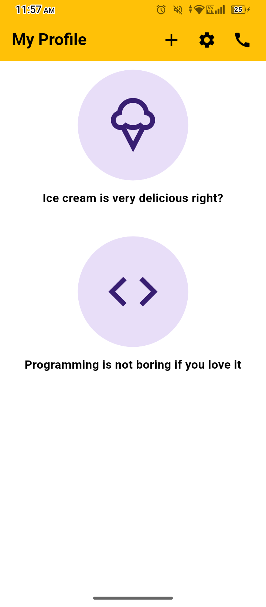

# 📱 Profile Screen — Module 5 Assignment

A pixel-perfect, clean, and responsive UI implementation of a Profile Screen built with **Flutter**. Developed as part of Module 5 Assignment, strictly adhering to clean code architecture and responsive layout guidelines.

---

## 📸 App Preview

<p align="center">
  
</p>

---

## 🚀 Key Features

* **Pixel-Perfect Alignment:** Carefully tuned spacing and typography to match the exact assignment layout requirements.
* **Modular Codebase:** Clean architecture separating screens (`lib/screens/`) and reusable widgets (`lib/widgets/`).
* **Dynamic & Reusable Widgets:** Fully customizable `InfoCard` widget for scalable UI components.
* **Overflow-Free Scrolling:** Wrapped with `SingleChildScrollView` to prevent screen overflows across various screen sizes.
* **Custom AppBar Implementation:** Extends `PreferredSizeWidget` to deliver a smooth and consistent top bar.

---

## 🛠️ Tech Stack & Architecture

* **Framework:** [Flutter](https://flutter.dev) (Dart)
* **Design Pattern:** Modular Component-based Architecture
* **Code Quality:** `flutter analyze` verified — 0 warnings/issues

---

## 📂 Project Structure

```text
lib/
├── screens/
│   └── dashboard_screen.dart   # Main screen context & layout
├── widgets/
│   ├── custom_app_bar.dart    # Custom preferred size AppBar  
│   └── info_card.dart         # Reusable card component
└── main.dart                  # App entry point